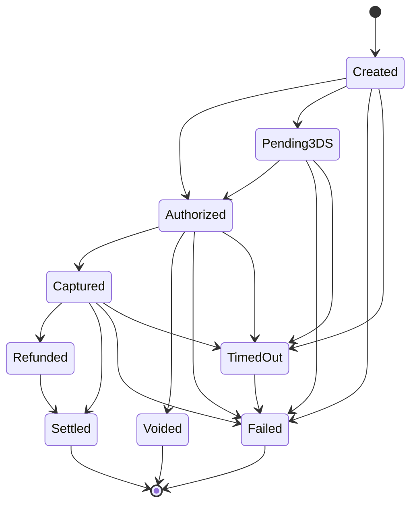
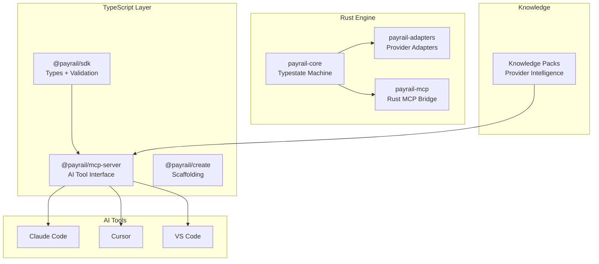

# PayRail

**Payment integrations that are correct by default.**

PayRail is a payment knowledge system with an AI interface. It combines a Rust engine with compile-time payment safety, a canonical contract layer that normalizes providers into a single state machine, and an MCP server that turns any AI coding tool into a payment domain expert.

## Why PayRail

Integrating payment providers is slow, error-prone, and repetitive. The average enterprise uses six to ten payment vendors, each requiring custom integration. PayRail solves this with three ideas:

- **Compile-time payment safety.** Rust's typestate pattern makes entire categories of payment bugs impossible. `Payment<Created>` cannot call `.refund()`. `Payment<Captured>` cannot be captured again. Double charges and invalid state transitions are compiler errors, not runtime exceptions.

- **AI that knows what it doesn't know.** Every fact in a knowledge pack carries a confidence score, source, and verification date. High confidence: generate directly. Medium: add a `VERIFY` comment. Low: refuse and ask the human.

- **MCP as distribution channel.** PayRail doesn't compete with Claude Code, Cursor, or Copilot. It makes them better at payments. Install the MCP server, and your AI assistant gains a payment brain.

## Quick Start

### Prerequisites

- Rust 1.93+ (`curl --proto '=https' --tlsv1.2 -sSf https://sh.rustup.rs | sh`)
- Node.js 20+
- pnpm 10+ (`npm install -g pnpm`)

### Install and Build

```bash
cd payrail

# Install TypeScript dependencies
pnpm install

# Build everything
cargo build
pnpm build

# Run all tests
cargo test
pnpm test
```

### Set Environment Variables

```bash
# Peach Payments sandbox
export PEACH_SANDBOX_API_KEY="your-api-key"
export PEACH_SANDBOX_ENTITY_ID="your-entity-id"
export PEACH_SANDBOX_WEBHOOK_SECRET="your-webhook-secret"

# Startbutton sandbox
export STARTBUTTON_SANDBOX_API_KEY="your-api-key"
export STARTBUTTON_SANDBOX_WEBHOOK_SECRET="your-webhook-secret"
```

## Usage

### 1. Create a Payment

Every payment starts with a `PaymentIntent` and enters the type-safe state machine:

```rust
use payrail_core::prelude::*;
use chrono::Utc;

let now = Utc::now();
let intent = PaymentIntent {
    id: PaymentId::new(),
    amount: Money::new(15000, Currency::ZAR), // R150.00 in integer cents
    provider: "peach_payments".to_owned(),
    metadata: serde_json::json!({"order_id": "ORD-001"}),
};

let payment = Payment::<Created>::create(intent, now);
```

Money is always in integer cents. `Money::new(15000, Currency::ZAR)` = R150.00. Floating point is not supported.

### 2. Process State Transitions

The compiler enforces which transitions are valid from each state:

```rust
// Authorize the payment
let authorized = payment.authorize(now);

// Capture the authorized payment
let captured = authorized.capture(now);

// Refund the captured payment
let refunded = captured.refund(now);
```

Invalid transitions are caught at compile time:

```rust
// These will NOT compile:
// payment.refund(now);        // Can't refund a Created payment
// captured.authorize(now);    // Can't re-authorize a Captured payment
// refunded.capture(now);      // Can't capture a Refunded payment
```

**State transition map:**



### 3. Execute Payments via Provider Adapters

Adapters translate between PayRail's canonical model and provider-specific APIs:

```rust
use payrail_adapters::{PeachPaymentsAdapter, AdapterConfig, AdapterRegistry};
use std::time::Duration;

// Configure the adapter
let config = AdapterConfig {
    provider_name: "peach_payments".to_owned(),
    sandbox: true,
    base_url: "https://sandbox.peachpayments.com".to_owned(),
    api_key_env_var: "PEACH_SANDBOX_API_KEY".to_owned(),
    webhook_secret_env_var: "PEACH_SANDBOX_WEBHOOK_SECRET".to_owned(),
    entity_id_env_var: "PEACH_SANDBOX_ENTITY_ID".to_owned(),
    timeout: Duration::from_secs(30),
};

let peach = PeachPaymentsAdapter::new(config);

// Execute a command against the provider
let event = peach.execute(PaymentCommand::Authorize, &intent).await?;
println!("Provider TX: {}", event.provider_transaction_id);
println!("New state: {:?}", event.state);
```

Use the `AdapterRegistry` to manage multiple providers:

```rust
let mut registry = AdapterRegistry::new();
registry.register("peach_payments", Box::new(peach));
registry.register("startbutton", Box::new(startbutton));

let adapter = registry.get("peach_payments").unwrap();
let event = adapter.execute(PaymentCommand::Capture, &intent).await?;
```

### 4. Handle Webhooks

The `WebhookReceiver` handles the full hot-path: verify signature, deduplicate, normalize, persist, and ACK.

```rust
use payrail_core::webhook::{WebhookReceiver, WebhookOutcome};
use payrail_core::{RawWebhook, SqliteEventStore, SqliteIdempotencyStore};
use chrono::Duration;

let event_store = SqliteEventStore::new("./payrail.db")?;
let idempotency_store = SqliteIdempotencyStore::new("./idempotency.db")?;
let receiver = WebhookReceiver::new(event_store, idempotency_store, Duration::hours(72));

// Wrap the incoming HTTP request
let raw = RawWebhook {
    headers: request.headers().clone(),
    body: request.body().to_vec(),
};

// Process the webhook
match receiver.handle(&raw, &peach_adapter, &secret_store).await? {
    WebhookOutcome::Processed { event } => {
        // New event recorded — return HTTP 200
        println!("Recorded: {}", event.event_id);
    }
    WebhookOutcome::Duplicate { idempotency_key, .. } => {
        // Already processed — return HTTP 200 (idempotent)
        println!("Duplicate: {}", idempotency_key);
    }
    WebhookOutcome::Deferred { reason } => {
        // Cannot safely process — return HTTP 503 (provider will retry)
        println!("Deferred: {}", reason);
    }
}
```

The receiver is **fail-closed**: if the idempotency store is unavailable, webhooks are deferred rather than processed without dedup protection.

### 5. Persist Events

All payment events are stored in an append-only event store for a full audit trail:

```rust
use payrail_core::{SqliteEventStore, EventStore, CanonicalEvent, EventType, EventId};

let store = SqliteEventStore::new("./payrail.db")?;

// Record an event
let event = CanonicalEvent {
    event_id: EventId::new(),          // evt_01HXYZ...
    event_type: EventType::new("payment.charge.captured")?,
    payment_id: intent.id.clone(),     // pay_01HXYZ...
    provider: "peach_payments".to_owned(),
    timestamp: Utc::now(),
    state_before: PaymentState::Authorized,
    state_after: PaymentState::Captured,
    amount: Money::new(15000, Currency::ZAR),
    idempotency_key: "peach:m123:webhook:evt_abc".to_owned(),
    raw_provider_payload: serde_json::json!({"result": "000.100.110"}),
    metadata: serde_json::json!({}),
};

store.append(&event).await?;

// Query by payment
let history = store.query_by_payment_id(&payment_id).await?;

// Query by event type
let captures = store.query_by_type(&EventType::new("payment.charge.captured")?).await?;
```

Events are **append-only** — no updates or deletes. This is the financial audit trail.

### 6. Enforce Timeouts

Every payment state has a configurable timeout. Payments that exceed their timeout auto-transition to `TimedOut`:

```rust
use payrail_core::{TimeoutConfig, TimeoutEnforceable};

let config = TimeoutConfig::default()
    .with_created(std::time::Duration::from_secs(600))        // 10 minutes
    .with_pending_3ds(std::time::Duration::from_secs(3600))    // 1 hour
    .with_authorized(std::time::Duration::from_secs(86400))    // 24 hours
    .with_captured(std::time::Duration::from_secs(2592000));   // 30 days

if payment.is_timed_out(&config, Utc::now()) {
    let timed_out = payment.timeout(Utc::now());
}
```

### 7. Use the MCP Server (AI-Powered Workflow)

Add PayRail to your AI tool's MCP configuration:

```json
{
  "mcpServers": {
    "payrail": {
      "command": "npx",
      "args": ["@payrail/mcp-server"]
    }
  }
}
```

Once connected, your AI assistant has four payment-specific tools:

**`query_provider_pack`** — Query structured provider knowledge:

```
> "What webhooks does Peach Payments send?"
> "Show me the status code mappings for Startbutton"
> "What's the 3DS flow for Peach?"
```

Query types: `overview`, `endpoints`, `webhooks`, `status_codes`, `error_codes`, `flows`

**`generate_adapter`** — Generate a conformance-tested adapter that matches your codebase conventions. The MCP server fingerprints your project (language, framework, ORM, test framework) and generates code that looks like you wrote it.

**`validate_state_machine`** — Validate payment state transitions in your code against the canonical 9-state machine. Detects missing transitions, invalid transitions, and unreachable states.

**`run_conformance`** — Run the conformance test suite against an adapter. Tests all canonical state transitions for correctness.

### 8. Use Runtime Transitions (for Dynamic Webhook Events)

When processing webhooks, you need runtime state transitions (the compile-time API requires knowing the state at code time):

```rust
use payrail_core::TransitionResult;

match payment.try_transition(PaymentState::Authorized, now) {
    TransitionResult::Applied { new_state, .. } => {
        println!("Transitioned to: {:?}", new_state);
    }
    TransitionResult::SelfTransition(_) => {
        println!("Duplicate event — already in this state");
    }
    TransitionResult::Rejected { error, .. } => {
        println!("Invalid: {} (code: {})", error, error.code());
        // error.code() → "PAY_INVALID_TRANSITION"
    }
}
```

### 9. Reconcile and Settle Payments

The reconciliation engine continuously verifies that your app's state matches the provider's confirmed state. When both agree, payments transition to `Settled`:

```rust
use payrail_core::reconciliation::{ReconciliationEngine, ReconciliationConfig};
use payrail_core::SqliteEventStore;

let store = SqliteEventStore::new("./payrail.db")?;
let engine = ReconciliationEngine::new(store, ReconciliationConfig::default());

// Reconcile a single payment
let result = engine.reconcile_payment(&payment_id, "peach_payments", Utc::now()).await?;

// Full cycle: reconcile → detect discrepancies → auto-resolve → escalate → settle
let cycle = engine.reconcile_and_handle(
    "peach_payments",
    &payment_ids,
    Utc::now(),
    &escalation_sink,
).await?;

println!("Matched: {}", cycle.matched);
println!("Settled: {}", cycle.settled);
println!("Escalated: {}", cycle.escalated);
```

From the CLI:

```bash
# View reconciliation report
payrail reconciliation --provider peach_payments --period 24h

# JSON output for dashboards
payrail --json reconciliation --provider peach_payments
```

See [docs/reconciliation.md](docs/reconciliation.md) for the full guide.

## Architecture



### Six-Layer Defense in Depth

Every payment passes through six independent safety barriers:

1. **Type system** — invalid transitions are compiler errors
2. **State machine** — runtime validation of canonical payment lifecycle
3. **Fail-closed idempotency** — duplicate requests are rejected, never processed unsafely
4. **Append-only event store** — full audit trail, no updates or deletes
5. **Webhook signature verification** — timing-safe HMAC, reject tampered payloads
6. **Continuous reconciliation** — verifies app state matches provider-confirmed state, auto-settles matched payments

## Project Structure

```
payrail/
├── crates/
│   ├── payrail-core/        # Typestate payment engine, event store, idempotency
│   ├── payrail-adapters/    # Provider-specific adapters (Peach, Startbutton)
│   ├── payrail-cli/         # CLI tool
│   └── payrail-mcp/         # Rust-side MCP bridge logic
├── packages/
│   ├── mcp-server/          # @payrail/mcp-server — AI tool interface (npm)
│   ├── sdk/                 # @payrail/sdk — canonical types + Zod validation
│   └── create/              # @payrail/create — project scaffolding (npx)
├── knowledge-packs/         # Provider knowledge packs (YAML source)
└── docs/                    # Documentation
```

### Rust Crates

| Crate | Purpose |
|-------|---------|
| `payrail-core` | Typestate payment machine, canonical events, event store, idempotency engine, webhook receiver, reconciliation engine |
| `payrail-adapters` | Provider adapters implementing the core adapter trait (Peach Payments, Startbutton) |
| `payrail-mcp` | Rust-side MCP bridge logic for cross-language calls |
| `payrail-cli` | Command-line interface — knowledge packs, adapter generation, conformance, reconciliation |

### TypeScript Packages

| Package | Purpose |
|---------|---------|
| `@payrail/mcp-server` | MCP server with tool registration, context assembly, codebase fingerprinting |
| `@payrail/sdk` | Canonical payment types, Zod schemas, snake-to-camel boundary transforms |
| `@payrail/create` | Quickstart scaffolding via `npx @payrail/create` |

## Supported Providers

| Provider | Status | Region |
|----------|--------|--------|
| Peach Payments | Adapter complete, conformance tested | South Africa |
| Startbutton | Adapter complete, conformance tested | South Africa |

Adding a provider requires an adapter implementation (~150-200 lines) and a knowledge pack. The conformance test harness validates all canonical state transitions automatically.

## Supported Currencies

| Currency | Code | Minor Units |
|----------|------|-------------|
| South African Rand | `ZAR` | 2 |
| US Dollar | `USD` | 2 |
| Euro | `EUR` | 2 |
| British Pound | `GBP` | 2 |

## Development

### Lint and Format

```bash
cargo clippy --all-targets -- -D warnings
cargo fmt --all -- --check
```

### Conventions

- **Money:** Integer cents, never floating point
- **Timestamps:** UTC always
- **IDs:** ULID-based with prefixes (`pay_`, `evt_`)
- **Events:** `domain.entity.action` format (e.g., `payment.charge.captured`)
- **Errors:** `[WHAT] [WHY] [WHAT TO DO]` format
- **Secrets:** Environment variables only

### Dependency Flow

```
payrail-core  (no internal deps)
    └── payrail-adapters  (depends on core)
         └── payrail-mcp  (depends on adapters)

@payrail/sdk  (standalone)
    └── @payrail/mcp-server  (depends on sdk)

@payrail/create  (standalone)
```

## License

MIT
