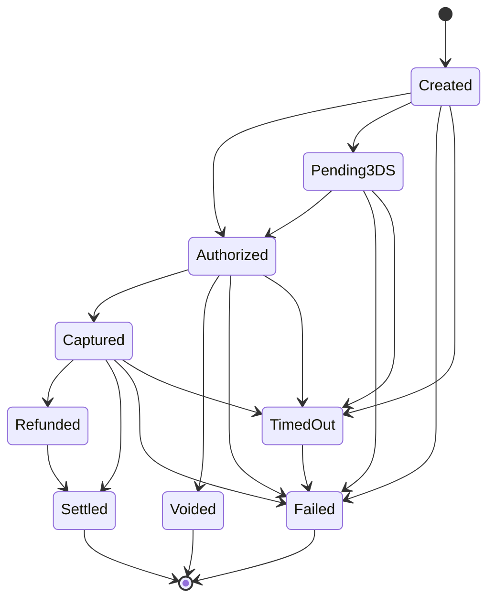

# Continuous Reconciliation & Settlement

PayRail's reconciliation engine continuously verifies that your application's view of payment states matches what the provider actually confirmed. When both sides agree, payments transition to `Settled` — the auditable proof that every cent is accounted for.

## Why Reconciliation Matters

When you charge a customer, your app optimistically records the payment as `Captured`. But the provider might have:

- **Silently failed** — your app says Captured, provider says Failed
- **Not confirmed yet** — webhook is delayed, provider hasn't responded
- **Processed differently** — amount mismatch, partial capture, or unexpected refund

Without reconciliation, these discrepancies go undetected until a customer complains or an accountant finds the gap. PayRail catches them automatically.

## The Settled State

`Settled` is a terminal state that represents financial truth: both your application and the provider agree on the payment's outcome, and this agreement is recorded with full provenance.

```
Captured ──settle()──> Settled
Refunded ──settle()──> Settled
```

Only `Captured` and `Refunded` payments can transition to `Settled`. Voided, Failed, and TimedOut payments are already terminal without reconciliation.

### State Transition Map (9 States)



### Compile-Time Safety

Settlement follows the same typestate pattern as all other transitions:

```rust
use payrail_core::prelude::*;
use chrono::Utc;

let now = Utc::now();

// A captured payment can be settled
let captured: Payment<Captured> = /* ... */;
let settled: Payment<Settled> = captured.settle(now);

// A refunded payment can also be settled
let refunded: Payment<Refunded> = /* ... */;
let settled: Payment<Settled> = refunded.settle(now);

// These will NOT compile:
// let settled = authorized.settle(now);  // Can't settle an Authorized payment
// let settled = created.settle(now);     // Can't settle a Created payment
```

## How Reconciliation Works

The reconciliation engine uses the event store's **dual-track state views**:

- **Optimistic state** — derived from the latest event by timestamp, regardless of source (app or provider)
- **Reconciled state** — derived only from provider-confirmed events

Each reconciliation cycle compares these two views for every payment:

```
┌─────────────────────────────────────────────────────┐
│              Reconciliation Cycle                     │
│                                                       │
│  For each payment:                                    │
│    optimistic  = event_store.optimistic_state(id)     │
│    reconciled  = event_store.reconciled_state(id)     │
│                                                       │
│    if optimistic == reconciled → Matched              │
│    if reconciled is None      → check timing window   │
│    if optimistic != reconciled → Material Mismatch    │
└─────────────────────────────────────────────────────┘
```

## Discrepancy Categories

When the engine detects a disagreement, it classifies the discrepancy into one of three categories:

| Category | Severity | Meaning | Action |
|----------|----------|---------|--------|
| **Timing Delay** | Low | Provider hasn't confirmed yet but still within the expected window | Auto-resolved when confirmation arrives |
| **Material Mismatch** | Medium | App says one state, provider says another | Escalated for investigation |
| **Permanent Divergence** | High | Confirmation window expired and provider never confirmed | Escalated as high priority |

### Confirmation Windows

Each provider has a configurable confirmation window — the time you expect between your app recording a state and the provider confirming it via webhook:

```rust
use payrail_core::reconciliation::ReconciliationConfig;
use std::time::Duration;

let mut config = ReconciliationConfig::default(); // 60-second default window

// Override for a specific provider
config.provider_confirmation_windows.insert(
    "peach_payments".to_string(),
    Duration::from_secs(120), // Peach gets 2 minutes
);
```

- **Within window, no confirmation** → Timing Delay (will likely resolve itself)
- **Past window, no confirmation** → Permanent Divergence (needs investigation)
- **Confirmation received but disagrees** → Material Mismatch

## Auto-Resolution

Timing delays are automatically re-evaluated each cycle. When the provider eventually sends a confirmation webhook that matches:

1. The engine detects the new provider event
2. Optimistic and reconciled states now agree
3. The discrepancy is marked as `AutoResolved`
4. The payment transitions to `Settled`

No human intervention required.

## Escalation

Material mismatches and permanent divergences are escalated via the `EscalationSink` trait:

```rust
use payrail_core::reconciliation::{
    EscalationSink, Escalation, LogEscalationSink, InMemoryEscalationSink,
};

// Production: log escalations (integrate with your alerting system)
let sink = LogEscalationSink;

// Testing: collect escalations in memory
let sink = InMemoryEscalationSink::default();
let escalations = sink.escalations(); // Vec<Escalation>
```

Each `Escalation` includes:
- Payment ID and provider
- Discrepancy category and severity
- Optimistic vs reconciled states
- Detection timestamp

Wire the `LogEscalationSink` into your alerting pipeline (PagerDuty, Slack, etc.) by reading the log output.

## Settlement Events

When a matched payment transitions to Settled, the engine creates an immutable event with full provenance:

```json
{
  "event_type": "payment.reconciliation.settled",
  "payment_id": "pay_01HXYZ...",
  "provider": "peach_payments",
  "state_before": "Captured",
  "state_after": "Settled",
  "metadata": {
    "reconciliation_timestamp": "2026-03-10T12:00:00Z",
    "confirmation_event_id": "evt_01HABC...",
    "match_type": "exact_state_match"
  }
}
```

This event is appended to the same append-only event store as all other payment events. It forms the auditable proof that reconciliation confirmed the payment.

## The Reconciliation Loop

For continuous operation, the `ReconciliationLoop` runs at a configurable interval:

```rust
use payrail_core::reconciliation::{
    ReconciliationEngine, ReconciliationLoop, ReconciliationConfig, PaymentIdSource,
};
use payrail_core::SqliteEventStore;
use std::time::Duration;
use tokio::sync::watch;

// Create the engine
let store = SqliteEventStore::new("./payrail.db")?;
let config = ReconciliationConfig {
    interval: Duration::from_secs(300), // Every 5 minutes
    ..Default::default()
};
let engine = ReconciliationEngine::new(store, config);

// Create a shutdown signal
let (shutdown_tx, shutdown_rx) = watch::channel(false);

// Create the loop with your payment source
let recon_loop = ReconciliationLoop::new(engine, payment_source, shutdown_rx);

// Run continuously (spawns on tokio runtime)
let handle = tokio::spawn(async move {
    recon_loop.run().await;
});

// To shut down gracefully:
shutdown_tx.send(true).unwrap();
handle.await.unwrap();
```

### PaymentIdSource Trait

You provide the set of payment IDs to reconcile by implementing `PaymentIdSource`:

```rust
use payrail_core::reconciliation::PaymentIdSource;
use payrail_core::PaymentId;
use async_trait::async_trait;

struct MyPaymentSource { /* your database connection */ }

#[async_trait]
impl PaymentIdSource for MyPaymentSource {
    async fn active_payment_ids(&self, provider: &str) -> Vec<PaymentId> {
        // Query your database for non-settled payments for this provider
        todo!()
    }

    fn providers(&self) -> Vec<String> {
        vec!["peach_payments".into(), "startbutton".into()]
    }
}
```

Each iteration:
1. Calls `providers()` to get the list of providers
2. For each provider, calls `active_payment_ids()` to get payments to check
3. Runs `reconcile_and_handle()` — reconcile, detect discrepancies, auto-resolve, escalate, settle

## Reconciliation Reports

The engine generates reports summarizing reconciliation results:

```rust
use payrail_core::reconciliation::{ReconciliationReport, ReconciliationEngine};

let report = engine.generate_report(
    "peach_payments",
    period_start,
    period_end,
    &results,
    &resolutions,
    settlements_count,
);

println!("Provider: {}", report.provider);
println!("Match rate: {:.1}%", report.match_rate);
println!("Timing delays: {}", report.discrepancies.timing_delay_count);
println!("Material mismatches: {}", report.discrepancies.material_mismatch_count);
println!("Settlements: {}", report.settlements);
```

### Report Fields

| Field | Type | Description |
|-------|------|-------------|
| `provider` | `String` | Provider name |
| `period_start` / `period_end` | `DateTime<Utc>` | Report time window |
| `total_payments` | `u64` | Payments checked in this cycle |
| `matched_count` | `u64` | Payments where both sides agree |
| `match_rate` | `f64` | Percentage (0.0 - 100.0) |
| `discrepancies.timing_delay_count` | `u64` | Awaiting provider confirmation |
| `discrepancies.material_mismatch_count` | `u64` | States disagree |
| `discrepancies.permanent_divergence_count` | `u64` | Confirmation window expired |
| `resolutions.auto_resolved_count` | `u64` | Resolved without human intervention |
| `resolutions.escalated_count` | `u64` | Sent to alerting |
| `resolutions.manually_resolved_count` | `u64` | Resolved by operator |
| `settlements` | `u64` | Payments transitioned to Settled |

## CLI Usage

The `payrail reconciliation` command displays reconciliation reports from the terminal:

```bash
# Default: all providers, last 24 hours
payrail reconciliation

# Filter by provider
payrail reconciliation --provider peach_payments

# Change time period
payrail reconciliation --period 7d

# Machine-readable JSON output
payrail --json reconciliation --provider peach_payments
```

### Human-Readable Output

```
  Reconciliation Report  peach_payments  Last 24h

  Total payments: 312
  Match rate: 98.7% (308/312)

  Discrepancies:
    Timing delays:         2 (auto-resolved)
    Material mismatches:   1 (escalated)
    Permanent divergence:  1 (high priority)

  Settlements: 308 payments transitioned to Settled
```

### JSON Output

```json
{
  "provider": "peach_payments",
  "period": {
    "start": "2026-03-09T12:00:00+00:00",
    "end": "2026-03-10T12:00:00+00:00"
  },
  "total_payments": 312,
  "matched": 308,
  "match_rate": 98.7,
  "discrepancies": {
    "timing_delay": 2,
    "material_mismatch": 1,
    "permanent_divergence": 1
  },
  "settlements": 308,
  "resolutions": {
    "auto_resolved": 2,
    "escalated": 1,
    "manually_resolved": 0
  }
}
```

### Available Periods

| Flag Value | Duration |
|------------|----------|
| `1h` | Last 1 hour |
| `12h` | Last 12 hours |
| `24h` | Last 24 hours (default) |
| `7d` | Last 7 days |

## Architecture

```
┌──────────────────────────────────────────────────────────────┐
│                    ReconciliationLoop                         │
│  ┌────────────┐   ┌──────────────────┐   ┌───────────────┐  │
│  │ PaymentId  │──>│ Reconciliation   │──>│ Discrepancy   │  │
│  │ Source     │   │ Engine           │   │ Detection     │  │
│  └────────────┘   └──────────────────┘   └───────┬───────┘  │
│                          │                        │          │
│                          v                        v          │
│                   ┌──────────────┐        ┌──────────────┐   │
│                   │ Settlement   │        │ Escalation   │   │
│                   │ Transition   │        │ Sink         │   │
│                   └──────┬───────┘        └──────────────┘   │
│                          │                                    │
│                          v                                    │
│                   ┌──────────────┐                            │
│                   │ Event Store  │                            │
│                   │ (append-only)│                            │
│                   └──────────────┘                            │
└──────────────────────────────────────────────────────────────┘
```

## Key Design Decisions

- **Stateless detection** — discrepancies are re-evaluated every cycle from the event store. No separate discrepancy database. The event store is the single source of truth.
- **Idempotent settlement** — settling an already-Settled payment is a no-op. Safe to re-run.
- **Integer cents** — all amounts in reports use `i64` cents, consistent with the rest of PayRail.
- **UTC timestamps** — all report periods and event timestamps are UTC.
- **Configurable per-provider** — each provider can have its own confirmation window, since webhook delivery times vary.
